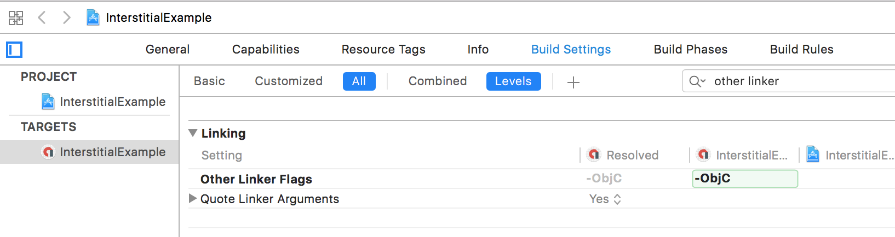
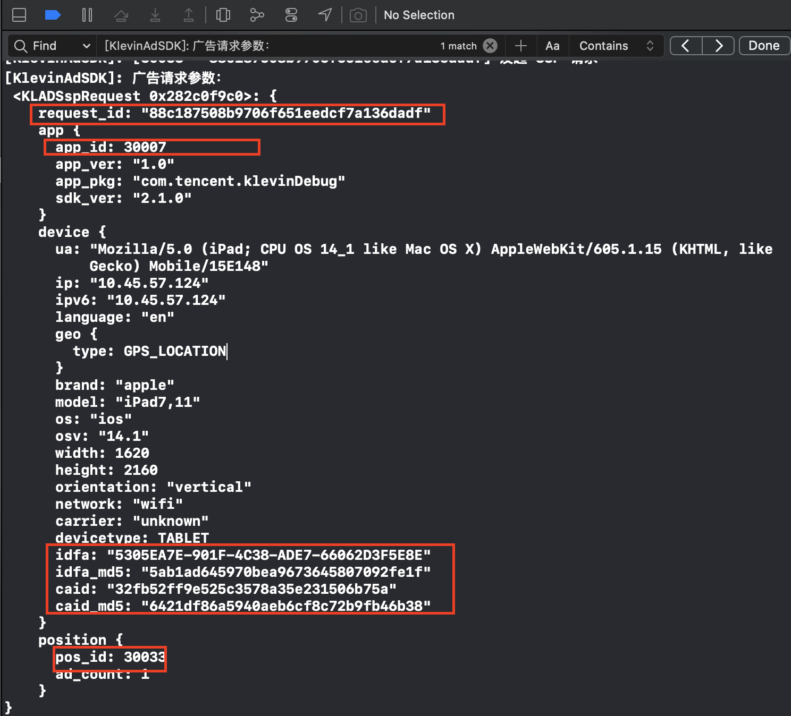

# 游可赢AdSDK iOS接入文档

尊敬的开发者朋友，欢迎使用游可赢广告SDK。本文档旨在帮助 iOS 应用开发者在程序中快速植入聚合广告平台提供的广告。通过本文档，您只需要进行简单配置，就可以快速接入本平台提供的广告。关于SDK具体使用方法，请仔细阅读下面的文档。

## 支持广告类型
| 类型 | 简介	| 使用场景 |
| :---- | :---- | :---- |
| 开屏广告 | 开屏广告以App启动为曝光时机，提供5s的可感知广告展示 | APP启动时，常会使用开屏广告 |
| 激励广告 | 指用户可以选择与之互动来换取应用内奖励的一种广告 | 领取道具，复活，补签到 |
| 插屏广告 | 插屏广告属于全屏广告，会覆盖宿主应用整个界面，通常展示在应用流程的自然过渡点上 | 页面跳转，活动间的切换处，游戏关卡间的暂停 |
| 原生自渲染 | 契合应用自身场景特性，开发者可根据广告场景自定义广告细节，同时兼顾广告效果和用户体验 | 信息列表，文章详情页，视频详情页等 |

## 集成及初始化SDK

### 集成环境要求

- 使用 Xcode 12 或更高版本
- App支持iOS iOS 9.0 或更高版本

### 通过Cocoapods集成

- 使用 Cocoaspods1.9.0 或更高版本

修改项目的 Podfile :

```shell
pod 'KlevinAdSDK'
```
然后使用命令行运行：
```shell
pod install --repo-update
```

### 手动集成

- 将提供的` KlevinAdSDK.framework `文件拖到 XCode 工程内（勾选` Copy items if needed `选项）
- 添加系统依赖库


| 库名称 | 说明  |
| :---- | :---- |
| StoreKit.framework |  |
| AdSupport.framework |  |
| SystemConfiguration.framework | 用于统计app信息 |
| CoreTelephony.framework | 用于统计app信息 |
| AVKit.framework |  |
| WebKit.framework |  |
| AVFoundation.framework |  |
| CoreMedia.framework |  |
| AppTrackingTransparency.framework | iOS 14+，Optional |

- Build Setting -> Other Linker Flags 添加 -ObjC 



### 项目配置

- ATS 配置

苹果公司在iOS9中升级了应用网络通信安全策略，默认推荐开发者使用HTTPS协议来进行网络通信，并限制HTTP协议的请求。为了避免出现无法拉取到广告的情况，我们推荐开发者设置 NSAllowsArbitraryLoadsInWebContent 和 NSAllowsArbitraryLoads 

```xml
<key>NSAppTransportSecurity</key>
<dict>    
 <key>NSAllowsArbitraryLoads</key>
 <true/>    
 <key>NSAllowsArbitraryLoadsInWebContent</key>
 <true/>
</dict>
```
### SDK初始化

在调用广告加载前，请先初始化SDK，初始化有两个方式：

- 初始化方式一

更新应用的 Info.plist 文件，添加以下键：

key值为` KlevinApplicationIdentifier `，类型为string，内容是申请的AppId：
```xml
<key>KlevinApplicationIdentifier</key>
<string>30709</string>
```
然后在AppDelegate的`application:didFinishLaunchingWithOptions:`方法中进行初始化：
```objective-c
#import <KlevinAdSDK/KlevinAdSDK.h>
 
@implementation AppDelegate
 
- (BOOL)application:(UIApplication *)application didFinishLaunchingWithOptions:(NSDictionary *)launchOptions { 
    // Override point for customization after application launch. 
 
    [KlevinAdSDK.sharedInstance startWithCompletionHandler:^(NSError * _Nullable error) { 
        if (error) { 
            // SDK初始化失败
        } 
    }]; 
    return YES;
}
```

- 初始化方式二

直接在AppDelegate的`application:didFinishLaunchingWithOptions:`方法中进行初始化：

```objective-c
#import <KlevinAdSDK/KlevinAdSDK.h>
 
@implementation AppDelegate
 
- (BOOL)application:(UIApplication *)application didFinishLaunchingWithOptions:(NSDictionary *)launchOptions { 
    // Override point for customization after application launch. 
 
    [KlevinAdSDK.sharedInstance startWithAppId
:@"30709" withCompletionHandler:^(NSError * _Nullable error) { 
        if (error) { 
            // SDK初始化失败
        } 
    }]; 
    return YES;
}
```

初始化API说明

| API方法 | 方法说明  |
| :---- | :---- |
| startWithCompletionHandler: | 初始化接口，必须在工程Info.plist里配置AppId  |
| startWithAppId: withCompletionHandler: | 动态传入appId初始化  |

### **隐私信息获取控制（合规管理）**

接入方根据自身情况及合规需要，可选择SDK是否可以获取地理位置信息、IDFA、CAID等信息(SDK不会触发地理位置权限、IDFA权限授权弹框)。接入方也可通过关闭相关接口，并主动传入的方式来替代SDK主动获取的行为。

```
/// SDK隐私信息访问控制配置类
/// 应用生命周期内，共享一个实例
@interface KlevinAdSDKConfiguration : NSObject

/// 默认配置，共享一个实例
@property (nonatomic, class, readonly) KlevinAdSDKConfiguration *configuration;

/// 是否允许获取定位信息，权限需由接入方获取，SDK不会主动弹框申请
/// 基于用户地理信息，系统能推荐更精准的个性化广告，提升广告收益
/// 默认为YES
@property (atomic, assign) BOOL allowAccessLocation;

/// 当前设备的经度：可接入方传递
@property (atomic, assign) float userLongitude;

/// 当前设备的纬度：可接入方传递
@property (atomic, assign) float userLatitude;

/// 是否允许获取设备IDFA，权限需由接入方获取，SDK不会主动弹框申请IDFA的访问权限
/// 若当前用户允许访问IDFA信息，且 allowAccessIDFA 为 YES，则SDK会访问IDFA信息
/// 默认为YES
@property (atomic, assign) BOOL allowAccessIDFA;

/// 接入方指定IDFA的值（若媒体传入非nil值，则SDK不会请求IDFA）
@property (atomic, copy, nullable) NSString *mediaIDFA;

/// 用户设备的CAID信息（若媒体传入非nil值，则SDK不会请求CAID）
@property (atomic, copy, nullable) NSString *mediaCAID;

@end
```

**注意：**

1. SDK不会触发任何权限申请的弹框授权；依赖于接入方的实现。
2. 建议在SDK初始化前设置`KlevinAdSDKConfiguration`相对应的值。

### SDK设置

- 定位权限

SDK不会主动弹窗请求定位权限，但是广告推荐系统在获知用户地理信息情况下，能提供更精准的个性化广告，从而帮助流量方提升广告收益。

在宿主获取了定位权限的前提下，SDK默认会获取位置信息。

如果不希望把位置信息提供给SDK，可以调用如下代码：

```objective-c
//不建议屏蔽定位权限，会影响广告收益
[KlevinAdSDK.sharedInstance enableGPS:NO];
```

- IDFA获取

SDK不会主动弹窗请求IDFA权限。当应用被用户授予广告追踪权限时，SDK将获取IDFA用于广告归因与追踪。

- Debug日志

使用XCode调试SDK，可以通过如下代码打开Debug Console日志：

```objective-c
[KlevinAdSDK.sharedInstance enableDebugLogout];
```

## 广告接入

在新版API中，开屏广告、插屏广告、激励广告的视图展示回调统一遵循代理 KLNFullScreenContentDelegate ，关于代理协议的方法说明如下：

<table>
  <tr>
    <td>协议名</td>
    <td>API方法</td>
    <td>API方法说明</td>
  </tr>
  <tr>
    <td rowspan="4">KLNFullScreenContentDelegate</td>
    <td>adDidRecordImpression</td>
    <td>广告曝光上报成功回调方法，业务方可以通过实现该方法，统计曝光量（对账）</td>
  </tr>
  <tr>
    <td>adDidPresentFullScreenContent</td>
    <td>广告视图展示（did appear）回调方法，业务方可以通过实现该方法，暂停业务视图上的动画/计时器等UI操作</td>
  </tr>
  <tr>
    <td>adDidDismissFullScreenContent</td>
    <td>广告视图移除（dismissal）回调方法，业务方可以通过实现该方法，恢复业务视图上的动画等UI操作</td>
  </tr>
  <tr>
    <td>ad:didFailToPresentFullScreenContentWithError</td>
    <td>广告展示失败回调方法，业务方可以通过实现该方法，处理广告展示失败事件；比如重新拉取广告</td>
  </tr>
</table>

### 开屏广告接入

#### 1. 加载广告并注册回调

开屏广告加载是通过调用` KLNSplashAd `类的静态方法` loadWithRequest: completionHandler: `完成的。该方法需要两个参数，一是` KLNSplashAdRequest `对象，二是加载成功或者失败的回调Block。加载成功得到KLNSplashAd实例后，注册代理对象，`KLNFullScreenContentDelegate `协议会在广告成功展示或展示失败，以及广告关闭时处理回调。

<table>
  <tr>
    <td>开屏请求参数类名</td>
    <td>参数</td>
    <td>参数说明</td>
  </tr>
  <tr>
    <td rowspan="4">KLNSplashAdRequest</td>
    <td>posId</td>
    <td>广告位置Id，初始化函数initWithPosId:必填参数</td>
  </tr>
  <tr>
    <td>timeout</td>
    <td>开屏超时时长，建议设置范围为3(秒)~5(秒)</td>
  </tr>
</table>

以下示例展示了如何在 AppDelegate 类中加载 KLNSplashAd ：

```objective-c
#import <KlevinAdSDK/KlevinAdSDK.h>

@interface AppDelegate ()
@property(strong, nonatomic) KLNSplashAd* splashAd;
@end

- (void)requestSplashAd {
	KLNSplashAdRequest *req = [[KLNSplashAdRequest alloc] initWithPosId:@"37060"];
	// 可选设置，设置了超时时长，则加载回调在超时限制内未成功加载到开屏广告，则会返回超时错误
    // 预拉取的场景建议不设置timeout或者设置一个相对较长的timeout时长，如60秒
    req.timeout = 3; 
    [KLNSplashAd loadWithRequest:req completionHandler:^(KLNSplashAd *splashAd, NSError *error) {
		if (error) {
			NSLog(@"Failed to load splash ad: %@", error);
			return;
		}
		self.splashAd = splashAd;
        self.splashAd.fullScreenContentDelegate = self;
	}];
}

#pragma mark - KLNFullScreenContentDelegate

- (void)adDidRecordImpression:(nonnull id<KLNFullScreenPresentingAd>)ad {
    NSLog(@"广告曝光上报打点成功：%s", __FUNCTION__);
    // TODO: 业务可以通过这个回调方法，上报广告曝光计数事件，与游可赢后台数据对账
}

- (void)ad:(nonnull id<KLNFullScreenPresentingAd>)ad
didFailToPresentFullScreenContentWithError:(nonnull NSError *)error {
    NSLog(@"广告展示失败：%li, %@", error.code, error.localizedDescription);
    // TODO: 业务方可以通过实现该方法，处理广告展示失败事件；比如重新拉取广告
    // 请根据具体的错误码来做出响应的操作

    if (ad == self.splashAd) {
        // 开屏广告
        [self preloadSplashAd];
        return;
    }
}

- (void)adDidPresentFullScreenContent:(nonnull id<KLNFullScreenPresentingAd>)ad {
    NSLog(@"%s", __FUNCTION__);
    // TODO: 业务方可以通过实现该方法，暂停业务视图上的动画/计时器等UI操作
}

- (void)adDidDismissFullScreenContent:(nonnull id<KLNFullScreenPresentingAd>)ad {
    NSLog(@"%s", __FUNCTION__);
    // TODO: 业务方可以通过实现该方法，恢复业务视图上的动画等UI操作
    // MARK: 也可以在广告结束曝光后，预加载下一个广告
    
    if (ad == self.splashAd) {
        // 开屏广告
         [self requestSplashAd];
         return;
    }
}
...

```

#### 2. 展示广告

开屏广告会在您的应用启动时或用户将其切换为在前台运行时展示。您可以通过在AppDelegate的 applicationDidBecomeActive: 方法加入如下代码来完成开屏广告展示：

```objective-c
- (void)tryToPresentAd {
    if (self.splashAd) {
        UIViewController *viewController = self.window.rootViewController;
        NSError *error = nil;    
        if ([self.splashAd canPresentFromRootViewController:viewController error:&error]) {
            [self.splashAd presentFromRootViewController:viewController];
        } else {
            //something went wrong.
            NSLog(@"splash can not show : code = %i, error = %@", error.code, [error localizedDescription]);
        }
    } else {
        // If you don't have an ad ready, request one.
        [self requestSplashAd];
    }
}

- (void)applicationDidBecomeActive:(UIApplication *)application {
	[self tryToPresentAd];
}
```

#### 3. 主要API

<table>
  <tr>
    <td>类名</td>
    <td>API方法</td>
    <td>API方法说明</td>
  </tr>
  <tr>
    <td rowspan="4">KLNSplashAd</td>
    <td>fullScreenContentDelegate</td>
    <td>广告行为回调代理，可以监听广告的曝光、展示、错误、dismiss等</td>
  </tr>
  <tr>
    <td>loadWithRequest: <br/> completionHandler:</td>
    <td>加载开屏广告入口，在回调block里返回广告实体对象，错误信息用NSError对象存储</td>
  </tr>
  <tr>
    <td>canPresentFromRootViewController: <br/> error:</td>
    <td>可以在展示前判断是否符合展示条件，错误信息用NSError对象返回</td>
  </tr>
  <tr>
    <td>presentFromRootViewController</td>
    <td>展示开屏广告，如发生错误通过代理方法返回</td>
  </tr>
</table>


### 插屏广告接入

#### 1. 加载广告并注册回调

插屏广告加载是通过调用` KLNInterstitialAd `类的静态方法` loadWithRequest: completionHandler: `完成的。该方法需要两个参数，一是` KLNInterstitialAdRequest `对象，二是加载成功或者失败的回调Block。加载成功得到KLNInterstitialAd实例后，注册代理对象，`KLNFullScreenContentDelegate `协议会在广告成功展示或展示失败，以及广告关闭时处理回调。

| 插屏请求参数类名 | 参数 | 参数说明 |
| :---- | :---- | :---- |
| KLNInterstitialAdRequest | posId | 广告位置Id，初始化函数initWithPosId:必填参数 |

以下示例展示了如何在 ViewController 类中加载 KLNInterstitialAd ：
```objective-c
@interface ViewController ()<KLNFullScreenContentDelegate>
@property(nonatomic, strong) KLNInterstitialAd *interstitialAd;
@end

@implementation ViewController

- (void)viewDidLoad {
  [super viewDidLoad];

  KLNInterstitialAdRequest *req = [[KLNInterstitialAdRequest alloc] initWithPosId:@"37061"];
  [KLNInterstitialAd loadWithRequest:req completionHandler:^(KLNInterstitialAd *ad, NSError *error) {
    if (error) {
      NSLog(@"Failed to load interstitial ad with error: %@", [error localizedDescription]);
      return;
    }
    self.interstitialAd = ad;
    self.interstitialAd.fullScreenContentDelegate = self;
  }];
}

#pragma mark - KLNFullScreenContentDelegate

- (void)adDidRecordImpression:(nonnull id<KLNFullScreenPresentingAd>)ad {
    NSLog(@"广告曝光上报打点成功：%s", __FUNCTION__);
    // TODO: 业务可以通过这个回调方法，上报广告曝光计数事件，与游可赢后台数据对账
}

- (void)ad:(nonnull id<KLNFullScreenPresentingAd>)ad
didFailToPresentFullScreenContentWithError:(nonnull NSError *)error {
    NSLog(@"广告展示失败：%li, %@", error.code, error.localizedDescription);
    // TODO: 业务方可以通过实现该方法，处理广告展示失败事件；比如重新拉取广告
    // 请根据具体的错误码来做出响应的操作

    if (ad == self.interstitialAd) {
        // TODO: 
        return;
    }
}

- (void)adDidPresentFullScreenContent:(nonnull id<KLNFullScreenPresentingAd>)ad {
    NSLog(@"%s", __FUNCTION__);
    // TODO: 业务方可以通过实现该方法，暂停业务视图上的动画/计时器等UI操作
}

- (void)adDidDismissFullScreenContent:(nonnull id<KLNFullScreenPresentingAd>)ad {
    NSLog(@"%s", __FUNCTION__);
    // TODO: 业务方可以通过实现该方法，恢复业务视图上的动画等UI操作
    // MARK: 也可以在广告结束曝光后，预加载下一个广告
    
    if (ad == self.interstitialAd) {
        // TODO: 预加载下一个插屏广告
        return;
    }
}
```

#### 2. 展示广告

下例演示了如何在 UIViewController 的其中一个操作方法中完成插屏广告展示操作：

```objective-c
- (void)showInterstitialAd {
    if (self.interstitialAd) {
        UIViewController *viewController = self;
        NSError *error;
        if ([self.interstitialAd canPresentFromRootViewController:viewController error:&error]) {
            [self.interstitialAd presentFromRootViewController:viewController];
        } else {
            //something went wrong.
            NSLog(@"interstitial can not show : code = %i, error = %@", error.code, [error localizedDescription]);
        }
    } else {
        NSLog(@"Ad wasn't ready");
    }
}
```

#### 3. 主要API

<table>
  <tr>
    <td>类名</td>
    <td>API方法</td>
    <td>API方法说明</td>
  </tr>
  <tr>
    <td rowspan="4">KLNInterstitialAd</td>
    <td>fullScreenContentDelegate</td>
    <td>广告行为回调代理，可以监听广告的曝光、展示、错误、dismiss等</td>
  </tr>
  <tr>
    <td>loadWithRequest: <br/> completionHandler:</td>
    <td>加载插屏广告入口，在回调block里返回广告实体对象，错误信息用NSError对象存储</td>
  </tr>
  <tr>
    <td>canPresentFromRootViewController: <br/> error:</td>
    <td>可以在展示前判断是否符合展示条件，错误信息用NSError对象返回</td>
  </tr>
  <tr>
    <td>presentFromRootViewController</td>
    <td>展示插屏广告，如发生错误通过代理方法返回</td>
  </tr>
</table>

### 激励广告接入

#### 1. 加载广告并注册回调

激励广告加载是通过调用` KLNRewardedAd `类的静态方法` loadWithRequest: completionHandler: `完成的。该方法需要两个参数，一是` KLNRewardedAdRequest `对象，二是加载成功或者失败的回调Block。加载成功得到KLNRewardedAd实例后，注册代理对象，`KLNFullScreenContentDelegate `协议会在广告成功展示或展示失败，以及广告关闭时处理回调。

<table>
  <tr>
    <td>激励广告请求参数类名</td>
    <td>参数</td>
    <td>参数说明</td>
  </tr>
  <tr>
    <td rowspan="4">KLNRewardedAdRequest</td>
    <td>posId</td>
    <td>广告位置Id，初始化函数initWithPosId:必填参数</td>
  </tr>
  <tr>
    <td>autoMute</td>
    <td>激励视频播放是否自动静音<br/>不设置，默认非静音播放</td>
  </tr>
  <tr>
    <td>rewardTrigger</td>
    <td>触发的激励类型，1：复活；2：签到；3：道具；4：虚拟货币；5：其他<br/>不设置，默认为0</td>
  </tr>
  <tr>
    <td>rewardTime</td>
    <td>激励卡秒时长<br/>默认为视频时长/赋值大于视频时长或者为非正数时，SDK以视频时长为准</td>
  </tr>
</table>

以下示例展示了如何在 ViewController 类中加载 KLNRewardedAd ：
```objective-c
@interface ViewController ()<KLNFullScreenContentDelegate>
@property(nonatomic, strong) KLNRewardedAd *rewardedAd;
@end

@implementation ViewController

- (void)loadRewardedAd {
  KLNRewardedAdRequest *req = [[KLNRewardedAdRequest alloc] initWithPosId:@"37062"];
  req.autoMute = NO;
  req.rewardTrigger = 2;
  req.rewardTime = 10;
  [KLNRewardedAd loadWithRequest:req completionHandler:^(KLNRewardedAd *rewardedAd, NSError *error) {
    if (error) {
      NSLog(@"Failed to load reward ad with error: %@", [error localizedDescription]);
      return;
    }
    self.rewardedAd = rewardedAd;
    self.rewardedAd.fullScreenContentDelegate = self;
  }];
}

#pragma mark - KLNFullScreenContentDelegate

- (void)adDidRecordImpression:(nonnull id<KLNFullScreenPresentingAd>)ad {
    NSLog(@"广告曝光上报打点成功：%s", __FUNCTION__);
    // TODO: 业务可以通过这个回调方法，上报广告曝光计数事件，与游可赢后台数据对账
}

- (void)ad:(nonnull id<KLNFullScreenPresentingAd>)ad
didFailToPresentFullScreenContentWithError:(nonnull NSError *)error {
    NSLog(@"广告展示失败：%li, %@", error.code, error.localizedDescription);
    // TODO: 业务方可以通过实现该方法，处理广告展示失败事件；比如重新拉取广告

    if (ad == self.rewardedAd) {
        // TODO: 请根据具体的错误码来做出响应的操作
        [self loadRewardedAd]; 
        return;
    }
}

- (void)adDidPresentFullScreenContent:(nonnull id<KLNFullScreenPresentingAd>)ad {
    NSLog(@"%s", __FUNCTION__);
    // TODO: 业务方可以通过实现该方法，暂停业务视图上的动画/计时器等UI操作
}

- (void)adDidDismissFullScreenContent:(nonnull id<KLNFullScreenPresentingAd>)ad {
    NSLog(@"%s", __FUNCTION__);
    // TODO: 业务方可以通过实现该方法，恢复业务视图上的动画等UI操作
    // MARK: 也可以在广告结束曝光后，预加载下一个广告
    
    if (ad == self.rewardedAd) {
        // TODO: 预加载下一个激励广告
        [self loadRewardedAd]; 
        return;
    }
}
```
#### 2. 展示广告并处理奖励事件

展示广告时，您必须提供` KLNAdUserDidEarnRewardHandler `对象，用于处理用户奖励。
以下代码演示了展示激励广告的最佳方法：

```objective-c
- (void)showRewardAd {
    if (self.rewardedAd) {
        UIViewController *viewController = self;
        NSError *error;
        if ([self.rewardedAd canPresentFromRootViewController:viewController error:&error]) {
            [self.rewardedAd presentFromRootViewController:viewController
                                  userDidEarnRewardHandler:^{
                                  KLNAdReward *reward =
                                      self.rewardedAd.adReward;
                                  // TODO: Reward the user!
                                }];
        } else {
            //something went wrong.
            NSLog(@"reward ad can not show : code = %i, error = %@", error.code, [error localizedDescription]);
        }
    } else {
        NSLog(@"Ad wasn't ready");
    }
}
```
#### 3. 视频边拉边播能力（v2.1新增）

为了满足开发者对激励广告短时间实时加载和展示的需求，SDK v2.1版本新增了请求广告接口（旧接口完全兼容，逻辑不变）：

```objective-c
/// 加载激励广告方法
/// @param request 激励广告请求对象
/// @param adLoadedCallback 激励广告信息加载成功回调（视频素材未下载完成），此时调用播放会触发边拉边播体验
/// @param completionHandler  广告加载结果回调（成功/失败）
+ (void)loadWithRequest:(KLNRewardedAdRequest *)request
adDidLoadHandler:(nullable KLNRewardedAdDidLoadCallback)adLoadedCallback
completionHandler:(KLNRewardedAdLoadCompletionHandler)completionHandler;
```

接口的使用可以参考 Demo工程。

#### 4. 主要API

<table>
  <tr>
    <td>类名</td>
    <td>API方法</td>
    <td>API方法说明</td>
  </tr>
  <tr>
    <td rowspan="5">KLNRewardedAd</td>
    <td>fullScreenContentDelegate</td>
    <td>广告行为回调代理，可以监听广告的曝光、展示、错误、dismiss等</td>
  </tr>
  <tr>
    <td>+loadWithRequest: <br />completionHandler:</td>
    <td>加载激励广告入口，在回调block里返回广告实体对象，错误信息用NSError对象存储</td>
  </tr>
  <tr>
    <td>+loadWithRequest: <br />adDidLoadHandler:<br />completionHandler:</td>
    <td>v2.1版本新增边拉边播接口回调。<br />在adDidLoadHandler回调中返回广告实体信息，此时触发广告展示，视频会边拉边播。<br />而completionHandler回调里，返回adDidLoadHandler中的广告对象则意味视频文件已经完整缓存在本地。若广告加载出错，则返回错误信息NSError对象
    </td>
  </tr>
  <tr>
    <td>canPresentFromRootViewController:<br />error:</td>
    <td>可以在展示前判断是否符合展示条件，错误信息用NSError对象返回</td>
  </tr>
  <tr>
    <td>presentFromRootViewController</td>
    <td>展示激励广告，如发生错误通过代理方法返回</td>
  </tr>
</table>


### 自渲染广告接入

#### 1. 加载广告并注册回调

自渲染广告加载是通过调用 `KLNUnifiedNativeAd` 类的静态方法 `loadWithRequest: completionHandler:` 完成的。该方法需要两个参数，一是 `KLNUnifiedNativeAdRequest` 对象，二是加载成功或者失败的回调Block。

加载成功得到 `KLNUnifiedNativeAd `实例数组后，对每个 `KLNUnifiedNativeAd` 实例可以注册 `KLNUnifiedNativeAdDelegate` 代理对象，`KLNUnifiedNativeAdDelegate` 协议会在广告素材加载成功或失败、广告曝光、广告点击时回调；你也可以给 `KLNUnifiedNativeAd` 实例的videoController属性设置代理，捕获视频广告播放相关的回调，目前支持视频静音、取消静音、开始/恢复播放、暂停播放、播放结束回调。

通过 `KLNUnifiedNativeAd` 实例，你可以获得自渲染广告相关的信息，比如广告渲染view、广告类型、APP图标URL、标题、描述、操作文案、游可赢广告标识图片；通过调用 `registerWithClickableViews` 注册可点击view，通过render来渲染广告，你也可以给广告设置静音等。

**SDK提供两种方式渲染广告：**

- 使用 `KLNUnifiedNativeAd` 实例的adView属性调用render方法来渲染广告，包括图片和视频。

- **从V2.2.0.276开始**，可以使用 `KLNUnifiedNativeAd` 实例的adView属性调用render方法来渲染视频广告；可以通过`KLNUnifiedNativeAd`实例的imageUrl获取图片链接，然后渲染到自己的view上。

- **从v2.4.1版本开始**，可以通过设置`autoDownloadPolicy`参数值来管理视频在指定网络环境下自动下载策略；

<table>
 <tr>
   <td>自渲染广告请求参数类名</td>
   <td>参数</td>
   <td>参数说明</td>
 </tr>
 <tr>
   <td rowspan="4">KLNUnifiedNativeAdRequest</td>
   <td>posId</td>
   <td>广告位置Id，初始化函数initWithPosId:必填参数</td>
 </tr>
 <tr>
   <td>adCount</td>
   <td>请求广告个数。推荐请求1个，最多请求10个。不填默认为1。<br/>注意：设置了adCount，后台可能不返回广告，也可能返回，最多返回adCount个广告。目前只支持设置1个。</td>
 </tr>
 <tr>
   <td>autoDownloadPolicy</td>
   <td>视频素材下载策略：控制视频素材下载时机；<br/>
    默认任意网络环境下自动下载视频<br/>
    如希望仅WIFI环境下自动下载视频，则可在请求前设置对应的值：KLNVideoDownloadPolicyWifiOnly。</td>
 </tr>
</table>

以下示例展示了如何在自己的VC中加载 `KLNUnifiedNativeAd` :

```objc
@interface KLNDemoUnifiedNativeViewController ()<UITableViewDelegate, UITableViewDataSource, KLNUnifiedNativeAdDelegate, UITextFieldDelegate, KLNAdVideoControllerDelegate>

@property (nonatomic, strong)UITableView *dataTableView;
@property (nonatomic, strong)NSMutableArray<KLNUnifiedNativeAd *> *adList;
@property (nonatomic, strong)UITextField *posIDTextField;
@property (nonatomic, strong)UILabel *adCountLabel;
@property (nonatomic, strong)UISlider *adCountSlider;

@property (nonatomic, strong)NSMutableArray<KLNUnifiedNativeAd *> *tempAdList;

@end

@implementation KLNDemoUnifiedNativeViewController

- (void)_initData{
   
   KLNUnifiedNativeAdRequest *request = [[KLNUnifiedNativeAdRequest alloc] initWithPosId:self.posIDTextField.text];
   request.adCount = self.adCountSlider.value;
   __weak typeof(self)weakSelf = self;
   [KLNUnifiedNativeAd loadWithRequest:request completionHandler:^(NSArray<KLNUnifiedNativeAd *> * _Nullable adList, NSError * _Nullable error) {

       if (adList && adList.count > 0) {
           weakSelf.adList = [adList mutableCopy];
           for (KLNUnifiedNativeAd * ad in weakSelf.adList) {
               ad.delegate = weakSelf;
               ad.viewController = weakSelf;
           }
           [weakSelf.dataTableView reloadData];
       }
   }];
   
//    // 如果要在广告素材加载成功显示广告，用下面这段代码
//    [KLNUnifiedNativeAd loadWithRequest:request completionHandler:^(NSArray<KLNUnifiedNativeAd *> * _Nullable adList, NSError * _Nullable error) {
//
//        if (adList && adList.count > 0) {
//            for (KLNUnifiedNativeAd * ad in adList) {
//                ad.delegate = weakSelf;
//                ad.viewController = weakSelf;
//                [weakSelf.tempAdList addObject:ad];
//            }
//        }
//    }];
}

#pragma mark - KLNUnifiedNativeAdDelegate
- (void)kln_unifiedNativeAdDidLoad:(KLNUnifiedNativeAd *)ad didCompleteWithError:(NSError *)error {
   KLNDemoLog(@"🌹自渲染广告素材加载完成 ad:%@ error:%@", ad, error);
   // 如果需要监听自渲染视频广告的播放回调，请设置videoController.delegate
   ad.videoController.delegate = self;
   
   // 如果要在广告素材加载成功显示广告，用下面这段代码
//    if (!error && ad && ![self.adList containsObject:ad]) {
//        [self.adList addObject:ad];
//        [self.dataTableView reloadData];
//    }
//
//    if (ad && [self.tempAdList containsObject:ad]) {
//        [self.tempAdList removeObject:ad];
//    }
}

- (void)kln_unifiedNativeAdWillExpose:(KLNUnifiedNativeAd *)ad{
   
   KLNDemoLog(@"🌹自渲染广告曝光 ad:%@", ad);
}

- (void)kln_unifiedNativeAdDidClick:(KLNUnifiedNativeAd *)ad{
   
   KLNDemoLog(@"🌹自渲染广告点击 ad:%@", ad);
}

#pragma mark - KLNAdVideoControllerDelegate

- (void)videoControllerDidMuteVideo:(KLNAdVideoController *)videoController {
   KLNDemoLog(@"🌹自渲染广告视频静音");
}

- (void)videoControllerDidUnmuteVideo:(KLNAdVideoController *)videoController {
   KLNDemoLog(@"🌹自渲染广告视频取消静音");
}

- (void)videoControllerDidPlayVideo:(KLNAdVideoController *)videoController {
   KLNDemoLog(@"🌹自渲染广告视频开始/恢复播放");
}

- (void)videoControllerDidPauseVideo:(KLNAdVideoController *)videoController {
   KLNDemoLog(@"🌹自渲染广告视频暂停播放");
}

- (void)videoControllerDidEndVideoPlayback:(KLNAdVideoController *)videoController {
   KLNDemoLog(@"🌹自渲染广告视频播放结束");
}

@end
```

完整代码请参考Demo。

#### 2. 展示广告

展示广告有两种方式：

* `loadWithRequest`拿到广告信息`KLNUnifiedNativeAd`数组后直接刷新你的列表；

* 在广告素材下载回调方法`kln_unifiedNativeAdDidLoad:`里面刷新你的列表。两种的区别是方式1渲染出广告view的时候素材可能还没下载完，这个时候广告view会转菊花。

代码片段如下：

```objc

- (void)_initData{
    
    KLNUnifiedNativeAdRequest *request = [[KLNUnifiedNativeAdRequest alloc] initWithPosId:self.posIDTextField.text];
    request.adCount = self.adCountSlider.value;
    __weak typeof(self)weakSelf = self;
    [KLNUnifiedNativeAd loadWithRequest:request completionHandler:^(NSArray<KLNUnifiedNativeAd *> * _Nullable adList, NSError * _Nullable error) {

        if (adList && adList.count > 0) {
            weakSelf.adList = [adList mutableCopy];
            for (KLNUnifiedNativeAd * ad in weakSelf.adList) {
                ad.delegate = weakSelf;
                ad.viewController = weakSelf;
            }
            [weakSelf.dataTableView reloadData];
        }
    }];
    
//    // 如果要在广告素材加载成功显示广告，用下面这段代码
//    [KLNUnifiedNativeAd loadWithRequest:request completionHandler:^(NSArray<KLNUnifiedNativeAd *> * _Nullable adList, NSError * _Nullable error) {
//
//        if (adList && adList.count > 0) {
//            for (KLNUnifiedNativeAd * ad in adList) {
//                ad.delegate = weakSelf;
//                ad.viewController = weakSelf;
//                [weakSelf.tempAdList addObject:ad];
//            }
//        }
//    }];
}

#pragma mark - KLNUnifiedNativeAdDelegate
- (void)kln_unifiedNativeAdDidLoad:(KLNUnifiedNativeAd *)ad didCompleteWithError:(NSError *)error{
    
    KLNDemoLog(@"🌹自渲染广告素材加载完成 ad:%@ error:%@", ad, error);
    
    // 如果需要监听自渲染视频广告的播放回调，请设置videoController.delegate
    ad.videoController.delegate = self;
    
    // 如果要在广告素材加载成功显示广告，用下面这段代码
//    if (!error && ad && ![self.adList containsObject:ad]) {
//        [self.adList addObject:ad];
//        [self.dataTableView reloadData];
//    }
//
//    if (ad && [self.tempAdList containsObject:ad]) {
//        [self.tempAdList removeObject:ad];
//    }
}

/*
使用KLNUnifiedNativeAd实例的adView属性调用render方法来渲染广告
包括图片和视频。
*/
- (void)refreshUIWithModel:(KLNUnifiedNativeAd *)model{
 
  if (!model) {
    return;
  }
 
  NSInteger adViewTag = 10000;
  UIView *subView = (UIView *)[self.myContentView viewWithTag:adViewTag];
  if ([subView superview]) {
    [subView removeFromSuperview];
  }
 
  self.curAd = model;
  model.adView.tag = adViewTag;
  [self.myContentView addSubview:model.adView];
 
  [self.curAd.adView mas_makeConstraints:^(MASConstraintMaker *make) {
     make.left.equalTo(self.myContentView);
     make.right.equalTo(self.myContentView);
     make.top.equalTo(self.myContentView);
     CGFloat wid = UIScreen.mainScreen.bounds.size.width - 2 * kUnifiedNativeAdBaseCell_horGap;
     CGFloat hei = [KLNUnifiedNativeAd calcHeiWithWidth:wid nativeAd:model];
     make.height.mas_equalTo(hei);
   }];
 
  [self.myContentView sendSubviewToBack:self.curAd.adView];
 
  [self.appIconImageView sd_setImageWithURL:[NSURL URLWithString:[model.appIconURL stringByAddingPercentEncodingWithAllowedCharacters:[NSCharacterSet URLQueryAllowedCharacterSet]]] placeholderImage:nil options:SDWebImageRetryFailed];
 
  self.adTitleLabel.text = model.title;
 
  self.adDescLabel.text = model.desc;
 
  [self.actionBtn setTitle:model.actionTitle forState:UIControlStateNormal];
 
  self.adLogoImageView.image = model.adLogoImage;
 
  if (model.adType == KLNUnifiedNativeAdTypeHorVideo) {
    self.volumeBtn.hidden = NO;
  }else{
    self.volumeBtn.hidden = YES;
  }
 
  self.volumeBtn.selected = model.isMuted;
 
  NSMutableArray *clickableViews = [NSMutableArray array];
  [clickableViews addObject:self];
  if (self.actionBtn) {
    [clickableViews addObject:self.actionBtn];
  }
 
  [model unregisterClickableViews];
  [model registerWithClickableViews:clickableViews adView:self];
 
  [model render];
}

/*
从V2.2.0.276开始，通过KLNUnifiedNativeAd实例的imageUrl获取图片链接。
然后渲染到自己的view上
*/
- (void)refreshUIWithModel:(KLNUnifiedNativeAd *)model{
 
  if (!model) {
    return;
  }
 
 
  self.curAd = model;
 
  [self.adImageView mas_updateConstraints:^(MASConstraintMaker *make) {
    CGFloat wid = UIScreen.mainScreen.bounds.size.width - 2 * kCustomPicUnifiedNativeCell_horGap;
    CGFloat hei = [KLNUnifiedNativeAd calcHeiWithWidth:wid nativeAd:model];
    make.height.mas_equalTo(hei);
  }];

  [self.adImageView sd_setImageWithURL:[NSURL URLWithString:[model.imageUrl stringByAddingPercentEncodingWithAllowedCharacters:[NSCharacterSet URLQueryAllowedCharacterSet]]] placeholderImage:nil options:SDWebImageRetryFailed];
 
  [self.appIconImageView sd_setImageWithURL:[NSURL URLWithString:[model.appIconURL stringByAddingPercentEncodingWithAllowedCharacters:[NSCharacterSet URLQueryAllowedCharacterSet]]] placeholderImage:nil options:SDWebImageRetryFailed];
 
  self.adTitleLabel.text = model.title;
 
  self.adDescLabel.text = model.desc;
 
  [self.actionBtn setTitle:model.actionTitle forState:UIControlStateNormal];
 
  self.adLogoImageView.image = model.adLogoImage;
 
  NSMutableArray *clickableViews = [NSMutableArray array];
  [clickableViews addObject:self];
  if (self.actionBtn) {
    [clickableViews addObject:self.actionBtn];
  }
 
  [model unregisterClickableViews];
  [model registerWithClickableViews:clickableViews adView:self];
}
```
完整代码请参考Demo。

#### 3. 主要API

<table>
  <tr>
    <td>类名</td>
    <td>API方法</td>
    <td>API方法说明</td>
  </tr>
  <tr>
    <td rowspan="25">KLNUnifiedNativeAd</td>
    <td>delegate</td>
    <td>KLNUnifiedNativeAdDelegate协议代理，会在广告素材加载成功或失败、广告曝光、广告点击时回调。</td>
  </tr>
  <tr>
    <td>+loadWithRequest: <br />completionHandler:</td>
    <td>加载自渲染广告入口，在回调block里返回广告实体对象数组，错误信息用NSError对象存储</td>
  </tr>
  <tr>
    <td>videoController</td>
    <td>视频播放器<br/>videoController的delegate属性设置代理，捕获视频广告播放相关的回调，目前支持视频静音、取消静音、开始/恢复播放、暂停播放、播放结束回调。</td>
  </tr>
  <tr>
    <td>adView</td>
    <td>广告view。接入方拿到这个view后可以加入到自己的视图中显示广告。</td>
  </tr>
  <tr>
    <td>registerWithClickableViews:</td>
    <td>参数clickableViews：<br/>注册可点击的视图数组，此数组内的广告元素会添加手势，可以响应广告对应的点击事件。<br/>从V2.2.0.276开始增加参数adView：<br/>传入显示广告的view，SDK需要对此view做曝光检测。<br/>升级到V2.2.0.276及以后的版本请做好兼容。<br/>从V2.4.0开始，点击视频广告，会跳转视频详情页。
    </td>
  </tr>
  <tr>
    <td>unregisterClickableViews</td>
    <td>解除注册可点击的视图数组。</td>
  </tr>
  <tr>
    <td>render</td>
    <td>渲染广告View。接入方拿到adView属性后，需要调用render方法才能渲染广告。<br/>只有接入方用KLNUnifiedNativeAd的属性adView进行广告渲染才调用此方法。否则不需要调用。</td>
  </tr>
  <tr>
    <td>calcHeiWithWidth:nativeAd:</td>
    <td>接入方传入宽度，计算adview的高度。</td>
  </tr>
  <tr>
    <td>dislike</td>
    <td>用户手动关闭广告时，请调用该方法。<br/>调用该方法有助于游可赢帮你改善广告推荐。</td>
  </tr>
  <tr>
    <td>title</td>
    <td>标题</td>
  </tr>
  <tr>
    <td>desc</td>
    <td>描述</td>
  </tr>
  <tr>
    <td>appIconURL</td>
    <td>App图标URL</td>
  </tr>
  <tr>
    <td>actionTitle</td>
    <td>按钮文案</td>
  </tr>
  <tr>
    <td>adLogoImage</td>
    <td>游可赢广告标识图片</td>
  </tr>
  <tr>
    <td>muted</td>
    <td>静音视频广告</td>
  </tr>
  <tr>
    <td>adType</td>
    <td>KLNUnifiedNativeAdType枚举。<br/>1001代表自渲染-横版大图16：9<br/>1002代表自渲染-横版视频16：9</td>
  </tr>
  <tr>
    <td>viewController</td>
    <td>开发者传入的用来present目标页的ViewController</td>
  </tr>
  <tr>
    <td>width</td>
    <td>广告宽度</td>
  </tr>
  <tr>
    <td>height</td>
    <td>广告高度</td>
  </tr>
  <tr>
    <td>imageUrl</td>
    <td>广告图片URL<br/>V2.2.0.276新增属性</td>
  </tr>
  <tr>
    <td>videoAutoPlayPolicy</td>
    <td>V2.2.0.286新增属性。<br/>视频广告自动播放策略。默认 KLNUnifiedNativeAdVideoAutoPlayPolicyAlways（总是自动播放）。<br/>KLNUnifiedNativeAdVideoAutoPlayPolicy类型枚举：<br/>KLNUnifiedNativeAdVideoAutoPlayPolicyAlways // 总是自动播放，无论网络条件<br/>KLNUnifiedNativeAdVideoAutoPlayPolicyWIFI  // WIFI 下自动播放<br/>KLNUnifiedNativeAdVideoAutoPlayPolicyNever  // 从不自动播放，无论网络条件</td>
  </tr>
</table>

#### 4. 其他说明

1. 广告曝光kln_unifiedNativeAdWillExpose:方法回调的时机需满足以下条件：广告view可见,alpha不小于0.9，曝光面积不小于50%，**广告view宽度不小于屏幕宽度三分之一(从V2.3.0.220开始该判断条件去掉)**，持续曝光1s。对于一个广告，只会执行曝光回调一次。

2. registerWithClickableViews方法中，clickableViews只接受可见视图的点击（有效点击），如果不可见，即便注册到clickableViews中也不会响应广告的点击事件。


## 常见问题

### SDK文件大小裁剪

为方便接入方开发者使用模拟器调试，SDK支持x86_64架构，开发者可以在发布APP前对SDK二进制文件进行裁剪，删掉x86_64架构代码，从而减少5M左右的包大小
Mac系统下执行命令行

```shell
lipo -remove x86_64 KlevinAdSDK.framework/KlevinAdSDK -o KlevinAdSDK.framework/KlevinAdSDK
```

### bitcode支持

如需支持bitcode，请与我们联系

### 广告实例使用

开屏广告`KLNSplashAd `、插屏广告` KLNInterstitialAd` 、激励广告 `KLNRewardedAd `加载返回实例不支持重复展示，建议在每次展示后，删除本地持有的广告对象实例，在`KLNFullScreenContentDelegate `的 `adDidDismissFullScreenContent: `方法中，加载另一个广告实例，以便在下一次曝光机会发生时，立即展示新的广告。

广告实例有效时长默认为3小时，在收到响应的错误码`14009`后，请删除该实例，并重新加载一个新的广告。

### 错误码说明

| 错误码 | 错误消息 | 最佳实践 |
| :---- | :---- | :---- |
| 1101 | 后台服务异常 | 请反馈给游可赢商务排查，提供错误码和错误信息 |
| 1104 | 后台服务异常 | 请反馈给游可赢商务排查，提供错误码和错误信息 |
| 1110 | 应用ID(AppID)异常 | 请自查AppID和PosID是否匹配 |
| 1111 | 资源位ID(PosID)异常 | 请自查AppID和PosID是否匹配 |
| 1113 | 资源位平台匹配异常，如安卓的应用使用了iOS的资源位ID | 请开发者自查参数问题 |
| 1207 | 广告请求成功，但无广告匹配 | 建议更换设备或使用Demo调试ID |
| 1250 | 广告请求成功，但无广告匹配 | 建议更换设备或使用Demo调试ID |
| 1251 | 广告请求成功，但无广告匹配 | 建议更换设备或使用Demo调试ID |
| 5102 | 请求参数错误，可能是request id 为空字符串，或者os字段不是 ios或 android | 自查后不能解决，请反馈给游可赢商务排查，提供错误码和错误信息 |
| 5300 | 广告请求成功，但无广告匹配 | 建议更换设备或使用Demo调试ID |
| 5301 | 广告请求成功，但无广告匹配 | 建议更换设备或使用Demo调试ID |
| 5302 | 广告请求成功，但无广告匹配 | 建议更换设备或使用Demo调试ID |
| 5400 | 短时间重复请求过多 | 请求过于频繁，服务器繁忙时会返回该错误码，请检测与控制请求频率 |
| 5402 | 短时间重复请求过多 | 请求过于频繁，服务器繁忙时会返回该错误码，请检测与控制请求频率 |
| 12001 | 初始化错误 | 请开发者自查参数问题 |
| 12002 | 内部错误 | 请把问题反馈给游可赢商务排查，提供错误码和错误信息 |
| 12003 | SDK未初始化 | 根据日志中的错误信息提示修改嵌入代码 |
| 13001 | 网络异常 | 请检查网络状态并重试 |
| 13002 | 网络超时 | 请检查网络状态并重试 |
| 13003 | 网络不可用，无法连接到服务器 | 请检查网络状态并重试 |
| 14001 | 初始化错误, 包括广告位为空、App ID为空、Context/Activity为空 | 请根据日志中的错误信息提示修改嵌入代码 |
| 14002 | 请检查 Manifest 文件中的 Activity/Service/Permission 的声明是否正确以及声明的权限是否都已授予 | 请根据日志中的错误信息提示修改嵌入代码 |
| 14003 | 开屏广告拉取超时，请自查开屏广告的拉取超时时间设置是否过短 | 请根据日志中的错误信息提示修改嵌入代码 |
| 14004 | 请求资源位ID参数为空 | 请开发者自查参数问题 |
| 14005 | 广告数量错误 | 请开发者自查参数问题 |
| 14006 | 应用横竖方向参数与广告位支持方向不匹配 | 开发自查应用横竖屏状态与广告位支持方向是否匹配 |
| 14007 | 功能不可用 | 联系游可赢团队 |
| 14008 | 重复曝光 | 重新请求新的广告 |
| 14009 | 广告已过期 | 重新请求新的广告 |
| 14010 | 请求广告传入参数错误 | 检查请求广告的传参 |
| 14011 | 展示广告传入参数错误 | 检查展示广告的传参 |
| 15001 | 服务端数据错误 | 建议稍后重试，如果重试仍然有错误，请反馈给游可赢商务 |
| 15002 | 视频素材下载错误 | 建议稍后重试，如果重试仍然有错误，请反馈给游可赢商务 |
| 15003 | 视频素材播放错误 | 建议稍后重试，如果重试仍然有错误，请反馈给游可赢商务 |
| 15004 | 数据解析失败 | 需要重新请求广告 |
| 15005 | 解析数据没有ad | 需要重新请求广告 |
| 15006 | 返回数据缺少必要字段 | 需要重新请求广告 |
| 15007 | 缓存解析失败 | 需要重新请求广告 |
| 15008 | 图片下载错误 | 建议稍后重试，如果重试仍然有错误，请反馈给游可赢商务 |
| 15009 | 非主线程UI操作 | 请开发者在主线程调用相应方法 |
| 其他 | 未知错误 | 请把问题反馈给游可赢商务排查，提供错误码和错误信息 |

## 接入问题排查

### DEMO测试ID

接入调试过程中若遇到正式ID请求不到广告(如1207等错误)，可用游可赢DEMO ID进行测试：

APPID：30709

POSID：

- 开屏广告：37060
- 激励视频：37061
- 插屏广告：37062
- 原生广告：37063

**请注意：发布前，请务必将对应的APPID和POSID修改为应用所申请的正确的值。**

### SDK日志查看
使用XCode调试SDK，可以通过如下代码打开Debug Console日志：
`[KlevinAdSDK.sharedInstance enableDebugLogout];`
SDK日志的tag以 “**[KlevinAdSDK]**” 开头：


### 排查问题所需信息
请求广告异常需提供广告请求的requestId，设备的idfa或caid等信息给游可赢排查。可通过日志过滤获取



### 版本升级注意事项

#### 2.1版本

2.1版本开屏广告会展示跳转App Store的提示信息.
